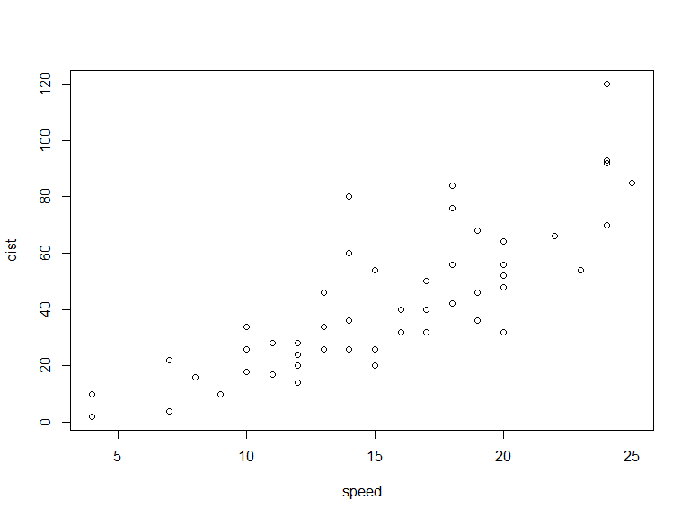

# chap5 통계학의 기초

## R Markdown


## 제 1절. 확률

### 1. 기본정의
< 사건 A의 발생확률 >

$$P(A) = \lim_{N \to \infty} \frac{N_A}{N}$$

### 2. 확률의 기본 공리와 법칙

< 확률의공리 >

1. 어떤 사건에대해서도 P(A) 는 다음을 만족한다.
$$0 \le P(A) \le 1$$

2. $P(\Omega) = 1$, $P(\phi) = 0$  여기서 $\Omega$는 표본공간， $\phi$은 공집합이다.

3. $P(\overline A) = 1 - P(A)$

< 확률의 덧셈법칙 >
$$P(A \cup B) = P(A) + P(B) - P(A \cap B)$$

< 조건부확률 >
$$P(A|B) = \frac {P(A \cap B)}{P(B)}$$


< 확률의 곱셈법칙 >
$$P(A \cap B) = P(A|B)P(B) = P(B|A)P(A)$$


< 통계적으로 독립인 두 사건 A와 B의 조건부 확률 >

$$P(A|B) = P(A \cap B) / P(B) = P(A)$$
$$P(B|A) = P(A \cap B) / P(A) = P(B)$$


## 제 2절. 확률변수와 확률분포


## 제 3절. 정규분포화 관련 분포


## 제 4절. 표본분포와 중심극한정리

### 1. 표본평균의 표본분포

< 표본평균의 표본분포 특성 >

1) $E(\overline x) = \mu$

2) $Var(\overline x) = \sigma^2 /n$ 이다. 따라서 $\overline x$의 표준편차 $\sigma_{\overline x}$는 $\sigma /\sqrt n$이며, 평균의 표준오차(standard error) 라고도 불린다

3) 만일 모집단이 정규분포하면 $\overline x$도 정규분포한다. 그리고 만일 모집단이 정규분포하지 않을 경우에도 표본의 크기 n 이 충분히 커지면(n>30) $\overline x$의 분포는 정규분포에 접근한다.


< 중심극한정리 >

모집단이 어떤 분포를 하여도 표본의 크기가 충분히 크먼 표본평균의 표본분포는 정규분포에 근접하게 된다. 그리고 표본크기가 커질수록 표본분포는 보다 더 정규분포에 가깝게 된다.


### 2. 표본분산의 표본분포

- 분산이 $\sigma^2$ 인 정규분포를 이루는 모집단에서 표본을 추출할 때， 각 표본의 분산 $S^2$의 표본분포는 정규분포와 다르게 항상 양(positive)의 값만을 가지며 비대칭 모양의 오른쪽 긴 꼬리를 가지는 $\chi^2$-분포를 따르게 된다.


## 제 5절. 추정


## 제 6절. 가설검정


## 제 7 절. 두 모집단 간 비교

### 1. 두 모집단의 평균 차에 대한 추론

- 1) 독립표본

< 두 모집단의 평균 차에 대한 추론 : 독립표본 >

모집단 분산을 모르나， 표본 크기가 충분히 큰 경우의 검정통계량은 다음과 같다.

$$Z = \frac{(\overline X_1 - \overline X_2) - (\mu_1 - \mu_2)_0}{\sqrt{S_1^2 / n_1 + S_2^2 / n_2}}$$

1. 가설설정 : $H_0 : \mu_1 - \mu_2 = (\mu_1 - \mu_2)_0$ 또는 $H_0 : \mu_1 - \mu_2 \le (\mu_1 - \mu_2)_0$

>> $H_1 : \mu_1 - \mu_2 > (\mu_1 - \mu_2)_0$

>결정규칙 : 검정통계량이 임계값 $z_\alpha$ 보다 크면 $H_0$ 를 기각

2. 가설설정 : $H_0 : \mu_1 - \mu_2 = (\mu_1 - \mu_2)_0$ 또는 $H_0 : \mu_1 - \mu_2 \ge (\mu_1 - \mu_2)_0$

>> $H_1 : \mu_1 - \mu_2 < (\mu_1 - \mu_2)_0$

>결정규칙 : 검정통계량이 임계값 $-z_\alpha$ 보다 작으면 $H_0$를기각

3. 가설설정 : $H_0 : \mu_1 - \mu_2 = (\mu_1 - \mu_2)_0$ 

>> $H_1 : \mu_1 - \mu_2 \ne (\mu_1 - \mu_2)_0$

>결정규칙 : 검정통계량이 임계값 $z_{\alpha /2}$ 보다 크거나$-z_{\alpha /2}$ 보다 작으면 $H_0$를 기각


## 

< 두 모집단의 평균 차에 대한 추론 : 독립표본 >

분산을 모르며 표본크기도 크지 않은 경우 : 두 모집단의 분산이 동일하다고 가정

$$Z = \frac{(\overline X_1 - \overline X_2) - (\mu_1 - \mu_2)_0}{S \sqrt{\frac{n_1 + n_2}{n_1n_2}}}$$
여기서 $$S =  \sqrt{\frac{(n_1 - 1)S_1^2 + (n_2 - 1)S_2^2}{n_1 + n_2 - 2}}$$

1. 가설설정 : $H_0 : \mu_1 - \mu_2 = (\mu_1 - \mu_2)_0$ ?????? $H_0 : \mu_1 - \mu_2 \le (\mu_1 - \mu_2)_0$

>> $H_1 : \mu_1 - \mu_2 > (\mu_1 - \mu_2)_0$

>결정규칙 : 검정통계량이 임계값 $t_{(n_1 + n_2 -2, \alpha)}$ 보다 크면 $H_0$ 를 기각

2. 가설설정 : $H_0 : \mu_1 - \mu_2 = (\mu_1 - \mu_2)_0$ ?????? $H_0 : \mu_1 - \mu_2 \ge (\mu_1 - \mu_2)_0$

>> $H_1 : \mu_1 - \mu_2 < (\mu_1 - \mu_2)_0$

>결정규칙 : 검정통계량이 임계값 $-t_{(n_1 + n_2 -2, \alpha)}$ 보다 작으면 $H_0$ 를 기각

3. 가설설정 : $H_0 : \mu_1 - \mu_2 = (\mu_1 - \mu_2)_0$ 

>> $H_1 : \mu_1 - \mu_2 \ne (\mu_1 - \mu_2)_0$

>결정규칙 : 검정통계량이 임계값 $t_{(n_1 + n_2 -2, \alpha /2)}$ 보다 크거나 $-t_{(n_1 + n_2 -2, \alpha /2)}$ 보다 작으면 $H_0$ 를 기각


## 
- 2) 짝진 표본


< 두 모집단의 평균 차에 대한 추론 : 짝진표본 >

분산을 모르며 표본 크기가 크지 않은 경우, d는 정규분포한다고 가정.

$$검정통계량: \frac{\overline d - (\mu_1 - \mu_2)_0}{S_d /\sqrt n}$$

1. 가설설정  : $H_0 : \mu_1 - \mu_2 = (\mu_1 - \mu_2)_0$ 또는 $H_0 : \mu_1 - \mu_2 \le (\mu_1 - \mu_2)_0$

>> $H_1 : \mu_1 - \mu_2 > (\mu_1 - \mu_2)_0$

>결정규칙 : 검정통계량이 임계값 $t_{(n -1, \alpha)}$ 보다 크면 $H_0$ 를 기각

2. 가설설정 : $H_0 : \mu_1 - \mu_2 = (\mu_1 - \mu_2)_0$ 또는 $H_0 : \mu_1 - \mu_2 \ge (\mu_1 - \mu_2)_0$

>> $H_1 : \mu_1 - \mu_2 < (\mu_1 - \mu_2)_0$

>결정규칙 : 검정통계량이 임계값 $-t_{(n -1, \alpha)}$ 보다 작으면 $H_0$ 를 기각

3. 가설설정 : $H_0 : \mu_1 - \mu_2 = (\mu_1 - \mu_2)_0$ 

>> $H_1 : \mu_1 - \mu_2 \ne (\mu_1 - \mu_2)_0$

>결정규칙 : 검정통계량이 임계값 $t_{(n -1, \alpha /2)}$ 보다 크거나 $-t_{(n -1, \alpha /2)}$ 보다 작으면 $H_0$ 를 기각


## 

### 2. 두 모집단의 분산비에 대한 추론


< F-분포의 특성 >

각 자유도에 의해 나눈 두 독립적인 $\chi^2$ -분포의 비율은 F-분포한다. 즉 자유도가 $q_1 = n_1 -1$ 인 $\chi^2$변수과 자유도가 $q_2 = n_2 -1$인 $\chi^2$ 변수가 있고 서로 독립적이면, 확률변수
$$F_{q_1, q_2} = \frac{\chi_{q_1}^2 /q_1}{\chi_{q_2}^2 /q_2}$$
는 자유도가 $q_1$ 과 $q_2$ 인 F-분포에 따른다.


##


< 두 정규모집단의 분산비에 대한 추론 >

$$검정통계량: S_1^2 /S_2^2$$

1. 가설설정 : $H_0 : \sigma_1^2 / \sigma_2^2 = 1$ ?????? $H_0 : \sigma_1^2 / \sigma_2^2 \le 1$ ,  $H_1 : \sigma_1^2 / \sigma_2^2 > 1$

>결정규칙 : 검정통계량이 임계값 $F_{(q_1, q_2, \alpha)}$  보다 크면 $H_0$ 를 기각


2. 가설설정 : $H_0 : \sigma_1^2 / \sigma_2^2 = 1$ 혹은 $H_0 : \sigma_1^2 / \sigma_2^2 \ne 1$ 

>결정규칙 : 검정통계량이 임계값 $F_{(q_1, q_2, \alpha /2)}$  보다 ???거나 $F_{(q_1, q_2,1 - \alpha /2)}$ 보다 작으면 $H_0$ 를 기각


## 제 8 절. 분산분석 (analysis of variance , ANOVA)


- < 표본 간 변동(SSB), 표본 내 변동(SSE)과 총 변동(SST) >

J개의 표본을 고려하는 경우 표본 간 변동은 표본 간 제곱합으로 SSB로 표기된다.

$\displaystyle SSB = \sum_{j=i}^J n_j (\overline X_j - \overline X)^2$

J개 표본 내 변동은 표본 내 제곱합으로 오차제곱의 합이라 하며 SSE로 표기된다.

$\displaystyle SSE = SS_1 + SS_2 + \dots + SS_j = \sum_{j=1}^J\sum_{i=1}^{n_j} (x_{ij} - \overline X_j)^2$

총 변동은 총 제곱합으로 SST로 표기되며 SSB와 SSE의 합과 같다.

$\displaystyle SST =  \sum_{j=1}^J\sum_{i=1}^{n_j} (x_{ij} - \overline X_j)^2 = SSB + SSE$


## Slide with R Code and Output


```r
summary(cars)
```

```
##      speed           dist       
##  Min.   : 4.0   Min.   :  2.00  
##  1st Qu.:12.0   1st Qu.: 26.00  
##  Median :15.0   Median : 36.00  
##  Mean   :15.4   Mean   : 42.98  
##  3rd Qu.:19.0   3rd Qu.: 56.00  
##  Max.   :25.0   Max.   :120.00
```

## Slide with Plot

 

